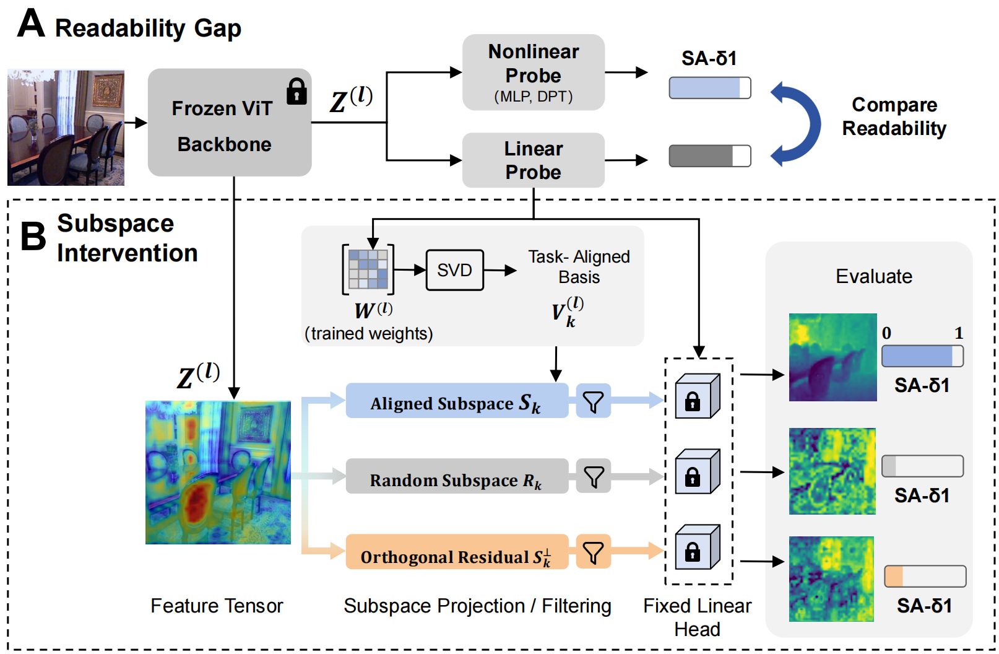

<div align="center">

# Understanding Geometric Representations in Self-Supervised Vision Transformers via Subspace Intervention #

<p align="center">
🎉 <b>Accepted to ECCV 2026</b>
</p>

<p>
<a href="https://zhou-weichen.github.io/">Weichen Zhou</a><sup>1</sup> ·
<a href="https://zou-yawen.github.io/">Yawen Zou</a><sup>1</sup> ·
<a href="https://sites.google.com/view/gczjp/">Chunzhi Gu</a><sup>2</sup> ·
<a href="https://www.dr-lab.org/dong/">Ran Dong</a><sup>3</sup> ·
<a href="https://www.jaist.ac.jp/~xie/">Haoran Xie</a><sup>4</sup> ·
<a href="https://sites.google.com/view/chao-zhang/profile">Chao Zhang</a><sup>1†</sup>
</p>

<sup>†</sup> Corresponding author.

<sup>1</sup> University of Toyama &nbsp;&nbsp;
<sup>2</sup> University of Fukui &nbsp;&nbsp;
<sup>3</sup> Chukyo University &nbsp;&nbsp;
<sup>4</sup> Japan Advanced Institute of Science and Technology &nbsp;&nbsp;

[](https://arxiv.org/abs/2607.01987)
[](https://github.com/Zhou-Weichen/Geosubprobe)
[](LICENSE)


<p align="center">
  
</p>

</div>

## 📦 Installation
```bash
git clone https://github.com/Zhou-Weichen/Geosubprobe.git
cd Geosubprobe

conda env create -f environment.yml
conda activate geosubprobe

pip3 install torch torchvision
pip install -e .
```

## 📅 Dataset Preparation
Please refer to [data_processing/README.md](data_processing/README.md) for detailed instructions on downloading and preprocessing all datasets.

## 🚀 Probe Training

We provide a sample script `run_all_layer.sh` to train different probes. It supports both multi-layer feature fusion (4 layers) and single-layer feature training modes.

```bash
# Run the full training pipeline (Multi-layer & Single-layer for all backbones)
bash run_all_layer.sh
```


## 🧩 Custom Probe Extension

You can easily implement your own probe structure by defining a custom head inside `evals/models/probes.py` and registering it to the `head_type` mapping.

### 1. Add Custom Head to Probe Classes
Open `evals/models/probes.py`, define your custom layer/network, and add it into the `head_type` routing :

```python
# evals/models/probes.py

# Step 1: Define your custom head architecture
class MyCustomHead(nn.Module):
    def __init__(self, input_dim, hidden_dim, output_dim, kernel_size=1):
        super().__init__()
        padding = kernel_size // 2
        self.net = nn.Sequential(
            nn.Conv2d(input_dim, hidden_dim, kernel_size, padding=padding),
            nn.BatchNorm2d(hidden_dim),
            nn.ReLU(inplace=True),
            nn.Conv2d(hidden_dim, output_dim, kernel_size, padding=padding)
        )
    def forward(self, x):
        return self.net(x)

# Step 2: Register it inside the DepthHead __init__
class DepthHead(nn.Module):
    def __init__(self, feat_dim, head_type="multiscale", ...):
        ...
        if head_type == "linear":
            self.head = Linear(feat_dim, output_dim, kernel_size)
        elif head_type == "my_custom_type":  # <--- Add your custom head type here
            self.head = MyCustomHead(feat_dim, hidden_dim, output_dim, kernel_size)
        ...
```


## Acknowledgements
This project is largely built upon [Probe3D](https://github.com/mbanani/probe3d). We thank the authors for open-sourcing their excellent implementation, which served as the foundation for our work.
